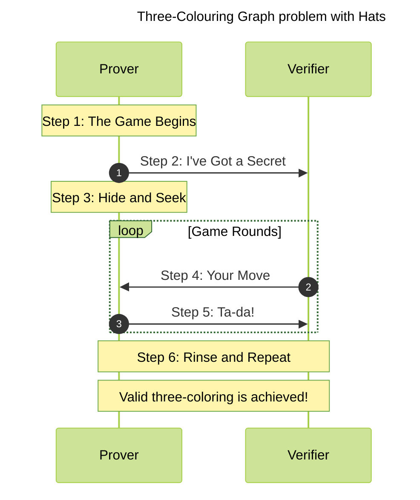
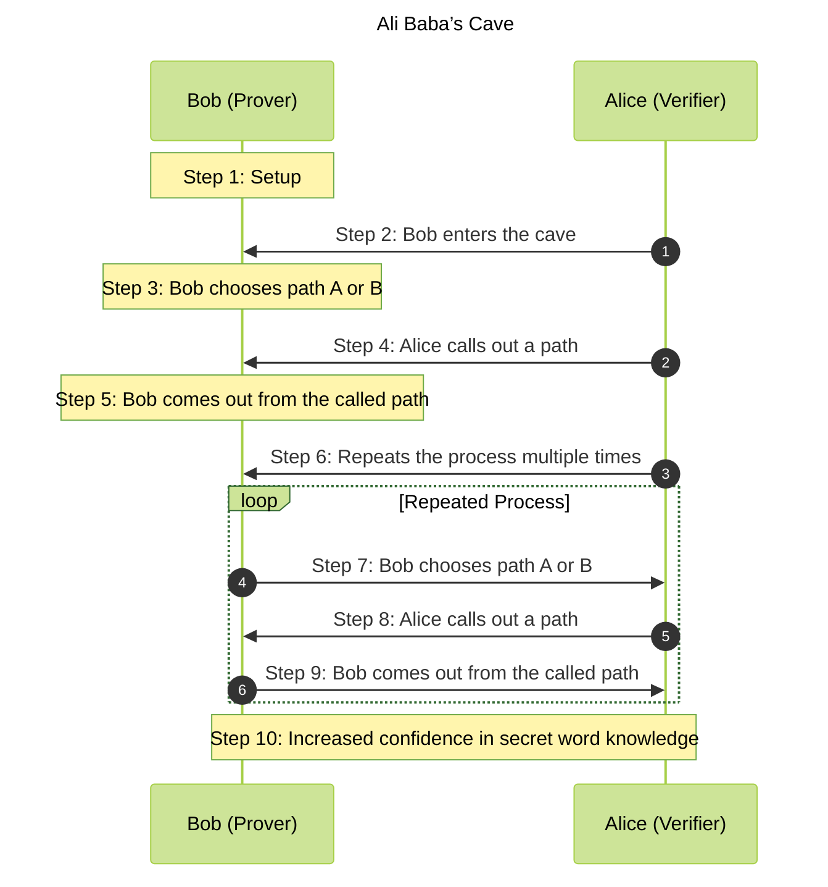

# [Exercises - Intro to ZKP Module 1](#exercises---intro-to-zkp-module-1)

Reference: [Module 1 - Intro to ZKP](https://pse-team.notion.site/Module-1-Intro-to-ZK-60814ca60a0142349d96a5d72afe8f55)

- [Exercises - Intro to ZKP Module 1](#exercises---intro-to-zkp-module-1)
  - [Comprehension](#comprehension)
    - [Three-Colouring Graph problem with Hats](#three-colouring-graph-problem-with-hats)
      - [Sequence diagram for the three-colouring graph problem with hats](#sequence-diagram-for-the-three-colouring-graph-problem-with-hats)
      - [Explanation of the three-colouring graph problem with hats sequence diagram](#explanation-of-the-three-colouring-graph-problem-with-hats-sequence-diagram)
      - [Explanation of the three-colouring graph problem with hats in plain English](#explanation-of-the-three-colouring-graph-problem-with-hats-in-plain-english)
    - [Ali Baba’s Cave analogy](#ali-babas-cave-analogy)
      - [Sequence diagram for the Ali Baba’s cave analogy](#sequence-diagram-for-the-ali-babas-cave-analogy)
      - [Explanation of the Ali Baba’s cave analogy sequence diagram](#explanation-of-the-ali-babas-cave-analogy-sequence-diagram)
      - [Explanation of the Ali Baba’s cave analogy in plain English](#explanation-of-the-ali-babas-cave-analogy-in-plain-english)
    - [The difference between interactive and non-interactive proofs](#the-difference-between-interactive-and-non-interactive-proofs)
  - [Modular Arithmetic](#modular-arithmetic)
  - [Generators](#generators)
  - [Implementing a Modular Arithmetic Calculator](#implementing-a-modular-arithmetic-calculator)
    - [Implementation of modularCalculator](#implementation-of-modularcalculator)


## [Comprehension](#comprehension)

Summarize each of the following concepts in a few sentences:

### [Three-Colouring Graph problem with Hats](#three-colouring-graph-problem-with-hats)


<sup><sub>***Image Source: https://blog.cryptographyengineering.com/2014/11/27/zero-knowledge-proofs-illustrated-primer/***</sub></sup>


 #### [Sequence diagram for the three-colouring graph problem with hats](#sequence-diagram-for-the-three-colouring-graph-problem-with-hats)



#### [Explanation of the three-colouring graph problem with hats sequence diagram](#explanation-of-the-three-colouring-graph-problem-with-hats-sequence-diagram)

1. The game begins with the Prover and Verifier participating.
2. The Prover informs the Verifier that they have a valid solution to the Three-Colouring problem, but they want to prove it without revealing the actual colors used.
3. The Prover puts hats on each point to hide their colors while keeping the connections visible.
4. The Verifier picks any two connected points and asks the Prover to reveal the colors of those points.
5. The Prover reveals the colors of the chosen points, demonstrating that the connected points have different colors as per the Three-Colouring rules.
6. The game repeats for several rounds, with the Prover shuffling the colors each time and the Verifier picking different pairs of connected points to verify.
7. After multiple rounds, the Verifier gains confidence that the Prover indeed has a valid three-coloring solution without knowing the exact colors used.

This sequence diagram represents the flow of the Zero-Knowledge Proof process using the Three-Colouring Graph problem with Hats analogy.


#### [Explanation of the three-colouring graph problem with hats in plain English](#explanation-of-the-three-colouring-graph-problem-with-hats-in-plain-english)

**Step 1: The Game Begins**

Picture this: We've got a network of points all connected together, kind of like a spider's web or a really complicated graph. The task is to color each point so that no two points that are connected have the same color, and we can only use three colors. This is what's known as a Three-Colouring problem.

**Step 2: I've Got a Secret**

So, let's say I've cracked it (Prover). I've managed to color all the points following the rules. But, I don't want to just show you my solution straight off - I want to prove to you that I've got a valid solution without giving away the game and telling you what colors I used for each point.

**Step 3: Hide and Seek**

Here's my plan: I put a hat on each point to hide its color. You can still see how the points are connected, but you can't see the colors I've chosen.

**Step 4: Your Move**

Your turn (Verifier). You pick any two points that are connected and ask me to lift the hats off these points.

**Step 5: Ta-da!**

I lift the hats off the two points you picked. Now you can see that these two connected points aren't the same color - just like the rules of the Three-Colouring problem say.

**Step 6: Rinse and Repeat**

We play this game a few more times. Each round, I mix up the colors (without messing up the valid three-coloring), put the hats back on, and you pick a different pair of connected points for me to reveal. 

After a few rounds, you start to feel pretty sure that I've got a valid three-color solution to the problem, even though you've never seen the whole solution at once. And there you have it, a Zero-Knowledge Proof - I've proven that I've got a valid solution without giving the game away. 

This is what's known as an interactive proof because it involves a bit of to-and-fro between you and me.

**Completeness**: If I am telling the truth, then you will eventually be convinced (at least with high probability).
**Soundness**: I can only convince you if I am actually telling the truth.
**Zero-knowledge**: You don’t learn anything else about my solution.


### [Ali Baba’s Cave analogy](#ali-babas-cave-analogy)


<sup><sub>***Image Source: https://upload.wikimedia.org/wikipedia/commons/c/cc/Zkip_alibaba2.png***</sub></sup>


#### [Sequence diagram for the Ali Baba’s cave analogy](#sequence-diagram-for-the-ali-babas-cave-analogy)




#### [Explanation of the Ali Baba’s cave analogy sequence diagram](#explanation-of-the-ali-babas-cave-analogy-sequence-diagram)

1. The setup is done, with Bob as the Prover and Alice as the Verifier.
2. Bob enters the circular cave with paths A and B and chooses one of them secretly.
3. Without revealing his choice, Bob stands in the chosen path.
4. Alice walks up to the cave entrance and calls out a path, either A or B, asking Bob to appear from that path.
5. Bob, who knows the secret word, can open the secret door and come out from the called path, regardless of his initial choice.
6. To increase confidence, Alice repeats the process multiple times.
7. In each repetition, Bob chooses a path, Alice calls out a path, and Bob comes out from the called path.
8. After several repetitions, Alice gains increased confidence that Bob knows the secret word, as it becomes less likely for Bob to guess correctly without knowing the secret word.

This sequence diagram represents the Zero-Knowledge Proof process using Ali Baba's Cave analogy, where Bob proves to Alice that he knows the secret word without revealing the actual word itself.


#### [Explanation of the Ali Baba’s cave analogy in plain English](#explanation-of-the-ali-babas-cave-analogy-in-plain-english)

Let's imagine a circular cave, kind of like a doughnut shape, with an entrance and a secret door. This secret door connects two different paths inside the cave, path A and path B. The trick is, the secret door can only be opened by someone who knows a special secret word.

Now, picture two people: Bob, who knows the secret word (Prover), and Alice, who wants to be sure that Bob knows the secret word (Verifier). However, Bob doesn't want to tell Alice the secret word (Zero Knowledge).

Here's how it works: Bob goes into the cave first, while Alice waits outside. Bob picks one of the two paths, A or B, to stand in, without revealing his choice to Alice.

Next, Alice walks up to the cave entrance and calls out a path, either A or B, and asks Bob to appear from that path.

Here's the catch: If Bob really knows the secret word, he can open the secret door and come out from whichever path Alice called, no matter which path he initially chose. But if Bob doesn't know the secret word, he can only come out from the path Alice called if he initially chose that path.

Since there are only two paths, Bob has a 50/50 chance of guessing correctly which path Alice will call. To be really sure that Bob knows the secret word, Alice repeats this process many times. Each time they go through this process, it becomes less likely that Bob could successfully guess Alice's calls without knowing the secret word.

This whole scenario illustrates three important principles of Zero-Knowledge Proofs:

- **Completeness**: If Bob truly knows the secret word, he should be able to convince Alice by always coming out from the path she calls.
- **Soundness**: If Bob doesn't know the secret word, there's a chance he might not be able to convince Alice because he might not be able to come out from the path she calls.
- **Zero Knowledge**: Through this whole process, Alice learns nothing about the secret word itself. The only thing she learns is whether or not Bob likely knows the secret word, based on how many times he successfully comes out from the path she calls.


### [The difference between interactive and non-interactive proofs](#the-difference-between-interactive-and-non-interactive-proofs)

In **Interactive Zero-Knowledge Proofs**, the prover and the verifier get into a sort of conversation. It's like they're playing a game of catch. The prover throws out commitments, then the verifier throws back challenges. The prover responds to these challenges. They keep this up until the verifier is confident that the prover is in the know. The Ali Baba cave story we talked about earlier is a good example of this kind of proof.

On the flip side, we have **Non-Interactive Zero-Knowledge Proofs**. These don't require any back-and-forth. It's a one-and-done message from the prover to the verifier that convinces the verifier that the prover knows the secret.

There are two main ways to pull off a non-interactive ZKP:

1. **The Fiat-Shamir Heuristic**: Here, the role of the verifier is played by a simulator that uses a hash function. This function, acting like a random fortune teller, is used on all the commitments. The result of this function is then used as the challenge. The prover can't predict what the hash function will come up with before making the commitments, which is what makes this method secure.

2. **Common Reference String (CRS)**: This method uses a random set of symbols, like pulling numbers from a hat, as a common reference string. It's assumed that these random values are available to all parties, but no party can influence what they'll be. The ZKP is then simulated with the random choices from the CRS, and the result should match anyone else checking the protocol transcript.

Non-interactive ZKPs are especially handy when there are a lot of observers who need to check the proof, because it allows for efficient verification without the need for each observer to interact with the prover. However, it does come with some extra assumptions, like the existence of a random oracle or a CRS.


## [Modular Arithmetic](#modular-arithmetic)

Solve the following problems and gain a practical understanding of modular arithmetic:

1. $7\ mod\ 13$

**Answer: 7**   

2. $15\ mod\ 13$

**Answer: 2**

3. $(7+15)\ mod\ 13$

**Answer: 9**

4. $(7\ mod\ 13\ +\ 15\ mod\ 13)\ mod\ 13$

**Answer: 9**

If the results of the third and fourth calculations match, they follow a “group structure”. Can you determine if these do?
**Yes, they follow the group structure**


## [Generators](#generators)

Consider the cyclic group $(Z12,+\ mod\ 12)$, commonly referred to as the “additive group of integers modulo 12”. Address the following points:

1. What does the term ‘generator’ mean?

**It is a group element which can generate all the other group elements when you repeatedly apply the group operation.**

2. Can you find a generator for this group?

**The group element 1 is a generator for $(Z12,+\ mod\ 12)$**

3. Are there other generators for this group? If yes, what are they?

**The group elements 5, 7, and 11 are the other generators. The full generator set is {1, 5, 7, 11}**


## [Implementing a Modular Arithmetic Calculator](#implementing-a-modular-arithmetic-calculator)

Your task is to implement a simple modular arithmetic calculator in JavaScript. The calculator should support three operations: addition, subtraction, and multiplication.

The function `modularCalculator` should take four parameters:

- A string, `op`, indicating the operation. It will be one of ‘+’, ‘-’, or ‘*’.
- Two integers, `num1` and `num2`, which are the operands for the operation.
- An integer, `mod`, which is the modulus.

The function should return the result of performing the indicated operation on `num1` and `num2`, then take the result modulo `mod`.

Remember, the result of subtraction could be negative, and in this case, you should add `mod` to the result to ensure it’s positive.

For addition and multiplication, remember that JavaScript’s % operator gives the remainder, not the modulus, but these will be the same for positive numbers.

**Code Template:**

```javascript
function modularCalculator(op, num1, num2, mod) {
    // Your code here
}

modularCalculator('+', 10, 15, 12); // Should return: 1
modularCalculator('-', 10, 15, 12); // Should return: 7
modularCalculator('*', 10, 15, 12); // Should return: 6

```

### [Implementation of modularCalculator](#implementation-of-modularcalculator)

**Here is the code for the modular calculator implementation in JS.**

```javascript
function modularCalculator(op, num1, num2, mod) {
    let result;
    switch (op) {
        case '+':
            result = num1 + num2;
            break;
        case '-':
            result = num1 - num2;
            break;
        case '*':
            result = num1 * num2;
            break;
        default:
            throw new Error('Invalid operation');
    }
    result = result % mod;
    if (result < 0) {
        result += mod; // If the result is negative, add `mod` to make it positive
    }
    return result;
}
```

You can find the full implementation including the test cases atthe repo [github.com/thogiti](https://github.com/thogiti/EFPSEZKFellowSummer). 

You can the test cases by typing ```npm test ``` in your terminal.